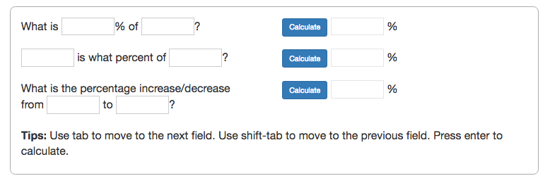

   

## Synopsis

3 projects to practice jQuery, Angular and  AJAX petitions:

### Asking to Spotify API using jQuery:

Create an app that:

- Allow us to search for an artist
- It should show a list of artists found
- When clicking an artist it should show a list of albums
- When clicking an album it should show a list of tracks
- When clicking a track it should reproduce a preview of the song (30'')

Resources:
+ https://developer.spotify.com/web-api/__
+ https://developer.spotify.com/web-api/search-item/
+ https://developer.spotify.com/web-api/get-artists-albums/
+ https://developer.spotify.com/web-api/get-albums-tracks/

[Here]('tree/master/01-jquery-spotify-API/') is my solution

### Percentage Calculator

Create the jQuery/Javascript code to make this works

[Here]('tree/master/02-percentatge-calculator/') is my solution

### Angular Movies

Create an angular app that creates 4 routes

    /popular
    /upcoming
    /nowPlaying
    /topRated

and shows the list of movies in each category

You can use the API https://www.themoviedb.org/documentation/api to get the data of each category 

You'll need to register your app and get an API-KEY to be able to do request to their API

[Here]('tree/master/03-angular-movies/') is my solution

## Motivation

Exercises done at the MEAN Stack [Skylabcoders Academy](http://www.skylabcoders.com/) bootcamp.